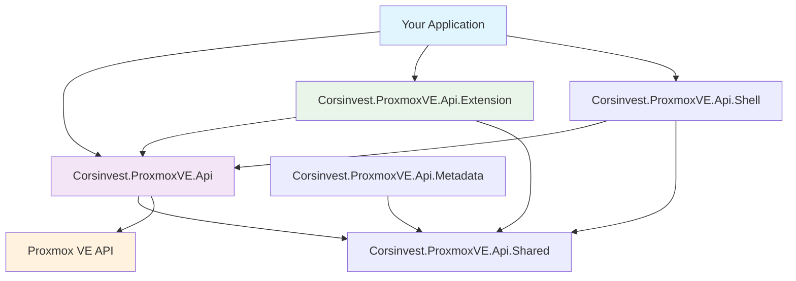

# Corsinvest.ProxmoxVE.Api 🔧

<div align="center">


**🚀 Official .NET Client Library Suite for Proxmox VE API**

[](LICENSE)
[](https://dotnet.microsoft.com/)
[](https://github.com/Corsinvest/cv4pve-api-dotnet)

⭐ **We appreciate your star, it helps!** ⭐

</div>

---

## 📖 About

<div align="center">

```
   ______                _                      __
  / ____/___  __________(_)___ _   _____  _____/ /_
 / /   / __ \/ ___/ ___/ / __ \ | / / _ \/ ___/ __/
/ /___/ /_/ / /  (__  ) / / / / |/ /  __(__  ) /_
\____/\____/_/  /____/_/_/ /_/|___/\___/____/\__/

Corsinvest for Proxmox VE Api Client (Made in Italy) 🇮🇹
```

</div>

A comprehensive .NET library suite for interacting with the [Proxmox VE API](https://pve.proxmox.com/pve-docs/api-viewer/). This collection provides everything you need to build powerful applications that manage Proxmox VE infrastructure programmatically.

## 🚀 Quick Start

```bash
# Install the main API package
dotnet add package Corsinvest.ProxmoxVE.Api

# Install extension package for additional functionality
dotnet add package Corsinvest.ProxmoxVE.Api.Extension
```

```csharp
using Corsinvest.ProxmoxVE.Api;

var client = new PveClient("your-proxmox-host.com");
if (await client.Login("root", "your-password"))
{
    // Get cluster status
    var status = await client.Cluster.Status.Status();
    Console.WriteLine($"Cluster: {status.Response.data[0].name}");

    // Manage VMs
    var vm = await client.Nodes["pve1"].Qemu[100].Config.VmConfig();
    Console.WriteLine($"VM: {vm.Response.data.name}");
}
```

---

## 📦 Package Suite

<div align="center">
  
| Package | Purpose | Documentation |
|---------|---------|---------------|
| **[Corsinvest.ProxmoxVE.Api](./docs/Api.md)** | 🔧 Core API Client | Main library for Proxmox VE API access |
| **[Corsinvest.ProxmoxVE.Api.Extension](./docs/Extension.md)** | 🚀 Extended Features | Helper methods and utilities |
| **[Corsinvest.ProxmoxVE.Api.Shared](./docs/Shared.md)** | 📊 Shared Models | Common models and utilities |
| **[Corsinvest.ProxmoxVE.Api.Shell](./docs/Shell.md)** | 💻 Console Tools | Console application utilities |
| **[Corsinvest.ProxmoxVE.Api.Metadata](./docs/Metadata.md)** | 📋 API Metadata | API documentation extraction |

</div>

---

## 🌟 Key Features

<table>
<tr>
<td width="50%">

### ⚡ **Developer Experience**

- **Async/Await** throughout the library
- **Strongly typed** models and responses
- **IntelliSense** support in all IDEs
- **Auto-generated** from official API docs
- **Tree structure** matching Proxmox VE API

### 🔧 **Core Functionality**

- **Full API coverage** for Proxmox VE
- **VM/CT management** (create, configure, snapshot)
- **Cluster operations** (status, resources, HA)
- **Storage management** (local, shared, backup)
- **Network configuration** (bridges, VLANs, SDN)

</td>
<td width="50%">

### 🛡️ **Enterprise Ready**

- **API token** authentication (Proxmox VE 6.2+)
- **Two-factor** authentication support
- **SSL certificate** validation
- **Configurable timeouts** and retry logic
- **Microsoft.Extensions.Logging** integration

### 🚀 **Advanced Features**

- **Extension methods** for common operations
- **Task management** utilities
- **Bulk operations** with pattern matching
- **Response type** switching (JSON, PNG)
- **Console application** helpers

</td>
</tr>
</table>

---

## 🎯 Choose Your Package

### 🔧 **Core API Client**

```bash
dotnet add package Corsinvest.ProxmoxVE.Api
```

Perfect for basic API operations and building custom solutions.
**[📖 Read Api Documentation →](./docs/Api.md)**

### 🚀 **Extended Functionality**

```bash
dotnet add package Corsinvest.ProxmoxVE.Api.Extension
```

Adds helper methods, VM discovery, and simplified operations.
**[📖 Read Extension Documentation →](./docs/Extension.md)**

### 📊 **Shared Models**

```bash
dotnet add package Corsinvest.ProxmoxVE.Api.Shared
```

Common models and utilities used across the suite.
**[📖 Read Shared Documentation →](./docs/Shared.md)**

### 💻 **Console Applications**

```bash
dotnet add package Corsinvest.ProxmoxVE.Api.Shell
```

Utilities for building command-line tools.
**[📖 Read Shell Documentation →](./docs/Shell.md)**

### 📋 **API Metadata**

```bash
dotnet add package Corsinvest.ProxmoxVE.Api.Metadata
```

Tools for API documentation extraction and analysis.
**[📖 Read Metadata Documentation →](./docs/Metadata.md)**

---

## 🛠️ Architecture Overview



---

## 📚 Documentation

### 🎓 **Getting Started**

- **[Authentication](./docs/Authentication.md)** - API tokens and security
- **[Basic Examples](./docs/Examples.md)** - Common usage patterns
- **[Advanced Usage](./docs/Advanced.md)** - Complex scenarios and best practices

### 📖 **API Reference**

- **[API Structure](./docs/ApiStructure.md)** - Understanding the tree structure
- **[Result Handling](./docs/Results.md)** - Working with responses
- **[Error Handling](./docs/ErrorHandling.md)** - Exception management
- **[Task Management](./docs/Tasks.md)** - Long-running operations

### 🔧 **Package Documentation**

Each package has detailed documentation with examples and API reference:

- **[📖 Api Package Documentation](./docs/Api.md)**
- **[📖 Extension Package Documentation](./docs/Extension.md)**
- **[📖 Shared Package Documentation](./docs/Shared.md)**
- **[📖 Shell Package Documentation](./docs/Shell.md)**
- **[📖 Metadata Package Documentation](./docs/Metadata.md)**

---

## 💡 Examples

### 🖥️ **VM Management**

```csharp
// Create and configure a VM
var client = new PveClient("pve.example.com");
await client.Login("admin@pve", "password");

var result = await client.Nodes["pve1"].Qemu.CreateVm(
    vmid: 100,
    name: "web-server",
    memory: 4096,
    cores: 2
);

if (result.IsSuccessStatusCode)
{
    Console.WriteLine("✅ VM created successfully!");
}
```

### 📊 **Cluster Monitoring**

```csharp
using Corsinvest.ProxmoxVE.Api.Extension;

// Get cluster overview with extension methods
var nodes = await client.GetNodesAsync();
foreach (var node in nodes)
{
    Console.WriteLine($"Node {node.Node}: CPU {node.CpuUsage:P2}, Memory {node.MemoryUsage:P2}");
}
```

### 🔍 **VM Discovery**

```csharp
// Find VMs using patterns (like cv4pve-autosnap)
var productionVms = await client.GetVmsAsync("@tag-production");
var webVms = await client.GetVmsAsync("web%");
var allExceptTest = await client.GetVmsAsync("@all,-@tag-test");
```

---

## 🤝 Community & Support

### 🏢 **Commercial Support**

Professional support and consulting available through [Corsinvest](https://www.corsinvest.it/cv4pve).

### 🌐 **Community Resources**

- **[GitHub Issues](https://github.com/Corsinvest/cv4pve-api-dotnet/issues)** - Bug reports and feature requests
- **[GitHub Discussions](https://github.com/Corsinvest/cv4pve-api-dotnet/discussions)** - Community Q&A
- **[NuGet Packages](https://www.nuget.org/profiles/Corsinvest)** - Package downloads and updates

### 🔄 **Contributing**

We welcome contributions! Please see our [Contributing Guide](./CONTRIBUTING.md) for details.

---

## 📄 License

**Copyright © Corsinvest Srl**

This software is part of the **cv4pve-tools** suite. For licensing details, please visit [LICENSE](LICENSE).

---

<div align="center">
  <sub>Part of <a href="https://www.cv4pve-tools.com">cv4pve-tools</a> suite | Made with ❤️ in Italy by <a href="https://www.corsinvest.it">Corsinvest</a></sub>
</div>
